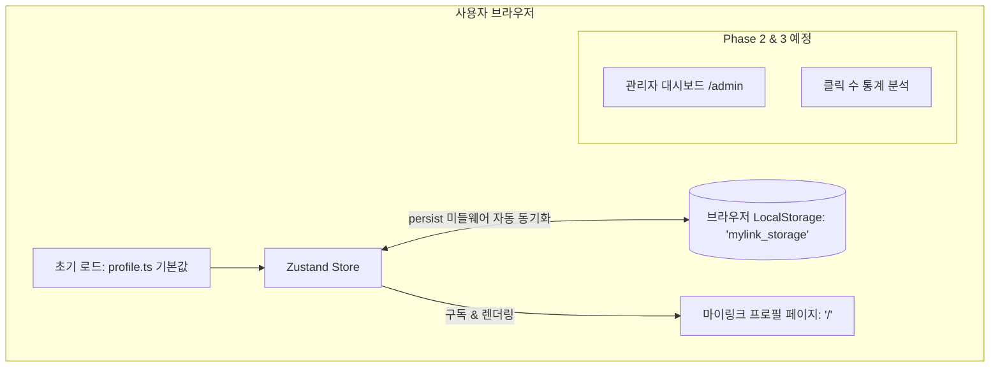
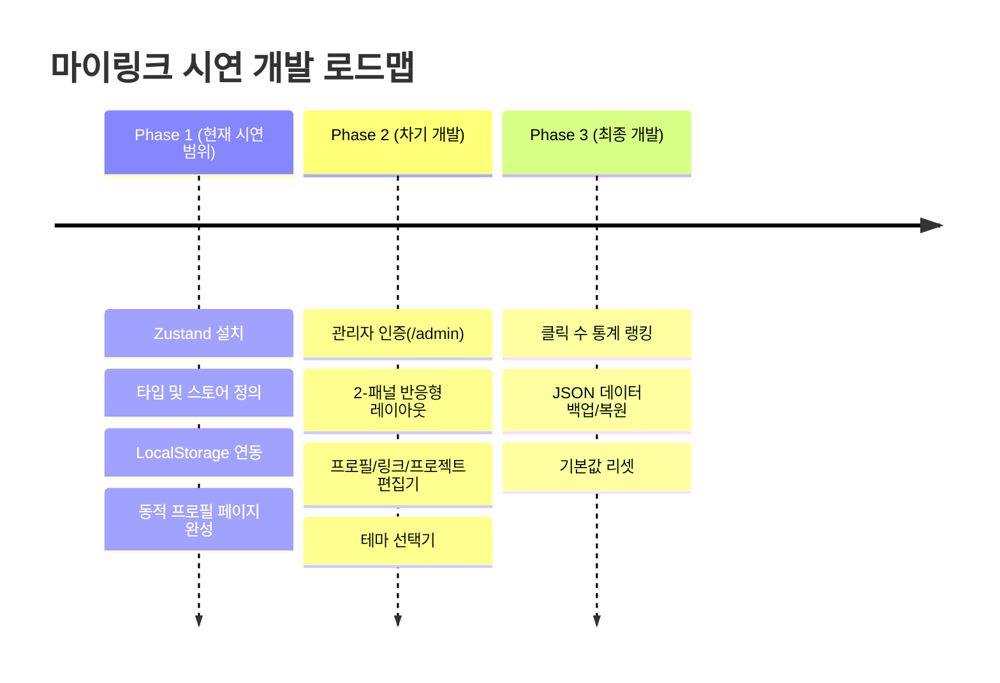

# [PRD] 링크트리 클론 서비스 "마이링크 (MyLink)" 기능 정의서

- **문서 버전**: v1.1.0 (단계별 시연 로드맵 반영)
- **작성일자**: 2026-09-23
- **프로젝트 명**: 마이링크 (MyLink)
- **진행 단계**: **Phase 1: LocalStorage 연동 동적 프로필 페이지 (현재 시연 범위)**

---

## 1. 프로젝트 개요 (Overview)

### 1.1 서비스 소개
**"마이링크 (MyLink)"**는 사용자의 다양한 소셜 미디어, 대표 프로젝트, 기술 스택, 커스텀 링크를 하나의 감각적인 단일 웹페이지에서 모아 보여주고 관리할 수 있는 **개인 맞춤형 링크트리 & 포트폴리오 웹 애플리케이션**입니다.

### 1.2 시연 및 단계별 개발 전략 (Phased Strategy for Demo)
본 프로젝트는 **라이브 시연(Live Demo)** 환경에 맞추어 기능 복잡도를 제어하고 완성도 높은 결과물을 점진적으로 보여주기 위해 다음과 같이 **단계별(Phased)**로 진행합니다.

- 🎯 **Phase 1 (현재 시연 범위 - 집중 목표)**:
  - **LocalStorage를 활용한 동적 프로필 페이지 단독 완성**
  - Zustand (`persist` 미들웨어) 기반으로 브라우저 로컬 스토리지와 실시간 동기화되는 프로필 페이지 구축
  - 복잡도를 낮추기 위해 **대시보드(`/admin`) 및 통계 기능은 Phase 1 범위에서 제외**
- 🔜 **Phase 2 (차기 시연 범위)**:
  - 마스터 비밀번호 인증 및 관리자 대시보드(`/admin`) 구축
  - 데스크톱 2-패널 실시간 스마트폰 프리뷰 에디터
- 🔜 **Phase 3 (최종 확장 범위)**:
  - 방문자 링크 클릭 수 로컬 트래킹(Analytics) 및 랭킹 시각화
  - JSON 데이터 백업(내보내기/가져오기) 및 기본값 리셋 엔진

### 1.3 타겟 사용자
- **소유자/관리자**: 자신의 작업물, 기술 블로그, 소셜 링크를 효과적으로 브랜딩하고 어필하고자 하는 프론트엔드/백엔드 개발자
- **방문자**: 모바일/PC 환경에서 개인의 링크 및 프로필을 열람하고 연락을 취하고자 하는 채용 담당자, 협업 파트너, 일반 팔로워

---

## 2. 시스템 아키텍처 & 기술 스택 (Architecture & Tech Stack)

### 2.1 기술 스택
- **프레임워크**: Next.js 16 (App Router 기반)
- **UI 라이브러리**: React 19
- **전역 상태 관리**: Zustand (`zustand`, 내장 `persist` 미들웨어 활용한 LocalStorage 자동 영속화)
- **스타일링**: Tailwind CSS v4, Toss Design System (TDS) 디자인 토큰
- **아이콘**: Lucide React + 커스텀 SVG 소셜 아이콘
- **데이터 저장소**: 브라우저 LocalStorage (저장 키: `'mylink_storage'`, 초기값: `profile.ts`)
- **언어**: TypeScript (엄격한 타입 안전성 보장)

### 2.2 서비스 아키텍처 다이어그램 (Phase 1 시연 기준)


---

## 3. 사용자 권한 및 역할 정의 (Roles & Permissions)

| 구분 | 접근 경로 | Phase 1 (현재 시연 범위) | Phase 2 & 3 (차기 개발 범위) |
| :--- | :--- | :--- | :--- |
| **방문자 / 사용자** | `/` | • 프로필, 스탯, 소개글 조회<br>• 탭 전환 (프로젝트, 기술스택, 링크모음)<br>• 링크 클릭 및 새 창 이동<br>• 프로필 링크 복사 & 이메일 복사<br>• **LocalStorage 기반 동적 데이터 즉시 반영** | • 링크 클릭 시 카운팅 누적 |
| **관리자 (Admin)** | `/admin` | *[Phase 1 제외 - 시연 집중]* | • 마스터 비밀번호 인증<br>• 웹 UI 상에서 프로필/링크/프로젝트 직접 수정<br>• 2-패널 실시간 모바일 프리뷰<br>• 통계 확인 및 JSON 백업 |

---

## 4. 상세 기능 명세서 (Functional Requirements)

### 4.1 [Phase 1] LocalStorage 연동 동적 프로필 페이지 (`/`)

#### 4.1.1 상단 네비게이션 & 공유 바
- **아바타 이니셜 & 사용자 이름**: 페이지 최상단 고정 (Sticky Header, 블러 효과 적용)
- **프로필 공유 버튼**: 클릭 시 현재 URL을 클립보드에 복사하고 TDS 스타일 토스트("프로필 링크를 복사했어요") 출력

#### 4.1.2 프로필 히어로 카드 (LocalStorage 연동)
- **프로필 이미지 (Avatar)**: 라운드 스퀘어(20px 곡률) 이미지 및 배경
- **이름 & 영문명**: 볼드 타이포그래피
- **직무/역할 (Role)**: 전문 분야 한 줄 표기
- **활동 상태 뱃지 (Status Pill)**: "새로운 기회와 프로젝트를 기다리고 있어요" 등 인디케이터 도트 뱃지
- **소개글 (Bio)**: 친근한 토스체(해요체) 소개 텍스트
- **스탯 요약 박스 (Stats)**: 3열 그리드 (프로젝트 수, 기술 스택 수, 커밋 수 등)
- **빠른 액션 버튼**:
  - `이메일 복사`: 클릭 시 이메일 주소 클립보드 복사 및 토스트 출력
  - `메일 앱 열기`: 기본 메일 클라이언트(`mailto:`) 실행

#### 4.1.3 소셜 아이콘 바 (Social Links Bar)
- GitHub, LinkedIn, Instagram, Velog 등 원클릭 소셜 아이콘 수평 정렬
- 마우스 호버 및 터치 시 부드러운 스케일/컬러 전환 애니메이션

#### 4.1.4 3단 분절 탭 컨트롤 (Segmented Control)
- **탭 1: 대표 프로젝트 (Projects)**
  - 프로젝트 썸네일, 제목, 설명, 태그 목록
  - "추천(Featured)" 뱃지 강조
  - 데모 링크(Live Demo) 및 GitHub 저장소 바로가기 버튼
- **탭 2: 기술 스택 (Skills)**
  - 카테고리별(Frontend, Core, Styling, Tools 등) 그룹화
  - 스킬 뱃지 및 숙련도/태그 표시
- **탭 3: 링크 모음 (Links - 핵심 링크트리 영역)**
  - **일반 링크**: 제목, 서브텍스트, 좌측 아이콘, 우측 화살표
  - **강조(Featured/Pulse) 링크**: 시선을 끄는 부드러운 글로우 애니메이션, 배지("NEW", "HOT", "추천")
  - **카테고리 구분 헤더**: 링크 그룹 간 구분선 및 섹션 제목
  - 대상 URL 새 창(`_blank`) 열기

#### 4.1.5 토스트 알림 (TDS Toast)
- 화면 하단 중앙 플로팅 토스트 (성공 체크 아이콘 + 애니메이션 페이드인/아웃, 2.4초 자동 소멸)

#### 4.1.6 SSR Hydration 안전 가드
- Next.js SSR 및 클라이언트 LocalStorage 데이터 로딩 간의 불일치를 방지하기 위한 안전한 Hydration 완료 플래그(`hasHydrated`) 처리

---

### 4.2 [Phase 2] 관리자 대시보드 (`/admin`) — *차기 구현 예정*
- **관리자 인증**: 마스터 비밀번호(`admin1234`) 인증 모달 및 세션 유지
- **2-패널 반응형 레이아웃**: 좌측 편집 폼 + 우측 스마트폰 목업 실시간 인터랙티브 프리뷰
- **프로필/스탯 편집기**: 이름, 소개글, 아바타 URL, 스탯 항목 수정
- **링크 블록 관리기**: 링크 CRUD, 순서 변경, 강조 배지 설정, 노출 활성/비활성 토글
- **프로젝트 & 스킬 관리기**: 프로젝트 및 기술 스택 항목 추가/수정/삭제
- **테마 프리셋 선택기**: Toss Light, Pure Dark, Soft Mint, Sunset Warm 전환

---

### 4.3 [Phase 3] 분석 통계 및 백업 엔진 — *차기 구현 예정*
- **링크 클릭 수 로컬 트래킹**: 링크 클릭 시 카운팅 누적 및 어드민 내 랭킹 차트 표시
- **JSON 백업 & 복원**: 전체 스토리지 데이터 다운로드, JSON 업로드 복원, 기본값 초기화 기능

---

## 5. 데이터 스키마 명세 (Data Schema & TypeScript Models)

```typescript
// 전체 마이링크 저장 스키마 (LocalStorage Key: 'mylink_storage')
export interface MyLinkStorageData {
  profile: ProfileInfo;
  links: LinkItem[];
  projects: ProjectItem[];
  skills: SkillCategory[];
  theme: ThemeConfig;
  analytics?: Record<string, number>; // Phase 3 예정
  updatedAt: string;
}

// 1. 프로필 정보 (Phase 1 활성)
export interface ProfileInfo {
  name: string;
  englishName: string;
  role: string;
  bio: string;
  statusBadge: {
    enabled: boolean;
    text: string;
  };
  email: string;
  avatarImage: string;
  stats: Array<{ label: string; value: string }>;
  socials: Array<{
    id: string;
    platform: "github" | "linkedin" | "instagram" | "velog" | "x" | "youtube" | "mail" | "custom";
    url: string;
    label: string;
  }>;
}

// 2. 링크 블록 항목 (Phase 1 활성)
export interface LinkItem {
  id: string;
  type: "link" | "highlight" | "header";
  title: string;
  subtitle?: string;
  url?: string;
  iconName?: string;
  badgeText?: string; // e.g. "HOT", "NEW", "추천"
  isActive: boolean;
  order: number;
}

// 3. 프로젝트 항목 (Phase 1 활성)
export interface ProjectItem {
  id: string;
  title: string;
  description: string;
  tags: string[];
  image: string;
  liveUrl?: string;
  githubUrl?: string;
  featured?: boolean;
}

// 4. 기술 스택 항목 (Phase 1 활성)
export interface SkillCategory {
  id: string;
  category: string;
  skills: string[];
}

// 5. 테마 설정 (Phase 1 기본 적용)
export interface ThemeConfig {
  preset: "toss-light" | "pure-dark" | "soft-mint" | "sunset-warm";
  accentColor?: string;
}
```

---

## 6. UI/UX 디자인 시스템 가이드 (TDS 기반)

- **디자인 톤앤매너**: Toss Design System(TDS) 스타일의 모던 & 미니멀리즘
- **주요 색상 토큰**:
  - `Toss Blue`: `#3182f6` (주요 CTA, 활성 인디케이터)
  - `Background`: `#f2f4f6` (페이지 배경), `#ffffff` (카드 및 서피스)
  - `Text Primary`: `#191f28` (주 타이틀, 본문)
  - `Text Secondary`: `#4e5968` / `#8b95a1` (보조 설명, 캡션)
  - `Border`: `#e5e8eb` (구분선 및 외곽선)
- **레이아웃**: 모바일 퍼스트 단일 셸 (최대 너비 480px) 중앙 정렬

---

## 7. 단계별 개발 일정 및 마일스톤 (Milestones)



- **✅ Phase 1 [현재 진행 목표]: LocalStorage 기반 동적 프로필 페이지**
  1. Zustand (`zustand`) 패키지 설치
  2. 타입 정의 (`src/types/index.ts`) 및 `useMyLinkStore` 스토어 구축 (`persist` 미들웨어 적용)
  3. 링크트리 블록 컴포넌트(`LinkCard`) 구현 (일반, 강조 펄스, 카테고리 헤더)
  4. `page.tsx`를 전역 스토어 구독 기반으로 리팩토링하여 LocalStorage 동적 렌더링 검증
- **⏳ Phase 2 [차기 단계]: 관리자 대시보드 (`/admin`)**
  - 마스터 비밀번호 인증 및 2-패널 실시간 스마트폰 프리뷰 편집 환경 구현
- **⏳ Phase 3 [차기 단계]: 통계 및 데이터 관리**
  - 링크 클릭 수 통계 집계 및 JSON 내보내기/가져오기 기능 추가
