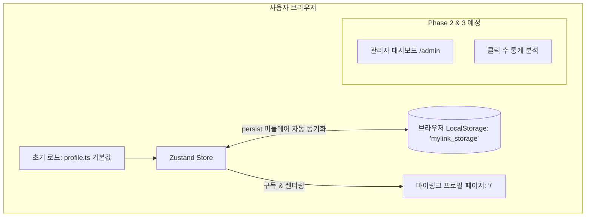
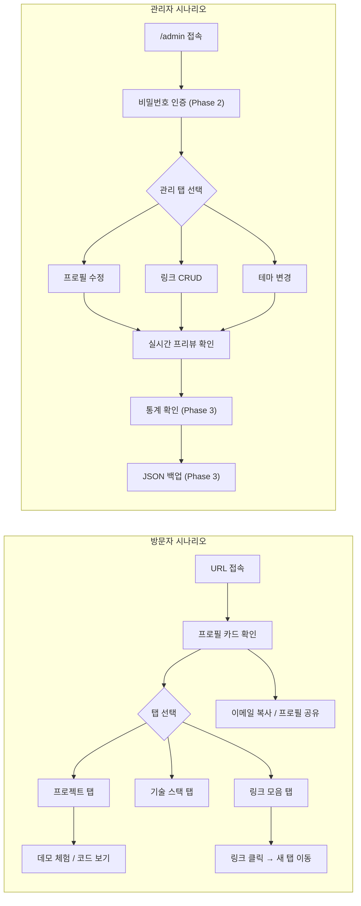

# [PRD] 링크트리 클론 서비스 "마이링크 (MyLink)" 기능 정의서

- **문서 버전**: v1.1.0 (단계별 시연 로드맵 반영)
- **작성일자**: 2026-09-23
- **프로젝트 명**: 마이링크 (MyLink)
- **진행 단계**: **Phase 1: LocalStorage 연동 동적 프로필 페이지 (현재 시연 범위)**

---

## 1. 프로젝트 개요 (Overview)

### 1.1 서비스 소개
**"마이링크 (MyLink)"**는 사용자의 다양한 소셜 미디어, 대표 프로젝트, 기술 스택, 커스텀 링크를 하나의 감각적인 단일 웹페이지에서 모아 보여주고 관리할 수 있는 **개인 맞춤형 링크트리 & 포트폴리오 웹 애플리케이션**입니다.

### 1.2 시연 및 단계별 개발 전략 (Phased Strategy for Demo)
본 프로젝트는 **라이브 시연(Live Demo)** 환경에 맞추어 기능 복잡도를 제어하고 완성도 높은 결과물을 점진적으로 보여주기 위해 다음과 같이 **단계별(Phased)**로 진행합니다.

- 🎯 **Phase 1 (현재 시연 범위 - 집중 목표)**:
  - **LocalStorage를 활용한 동적 프로필 페이지 단독 완성**
  - Zustand (`persist` 미들웨어) 기반으로 브라우저 로컬 스토리지와 실시간 동기화되는 프로필 페이지 구축
  - 복잡도를 낮추기 위해 **대시보드(`/admin`) 및 통계 기능은 Phase 1 범위에서 제외**
- 🔜 **Phase 2 (차기 시연 범위)**:
  - 마스터 비밀번호 인증 및 관리자 대시보드(`/admin`) 구축
  - 데스크톱 2-패널 실시간 스마트폰 프리뷰 에디터
- 🔜 **Phase 3 (최종 확장 범위)**:
  - 방문자 링크 클릭 수 로컬 트래킹(Analytics) 및 랭킹 시각화
  - JSON 데이터 백업(내보내기/가져오기) 및 기본값 리셋 엔진

### 1.3 타겟 사용자
- **소유자/관리자**: 자신의 작업물, 기술 블로그, 소셜 링크를 효과적으로 브랜딩하고 어필하고자 하는 프론트엔드/백엔드 개발자
- **방문자**: 모바일/PC 환경에서 개인의 링크 및 프로필을 열람하고 연락을 취하고자 하는 채용 담당자, 협업 파트너, 일반 팔로워

---

## 2. 시스템 아키텍처 & 기술 스택 (Architecture & Tech Stack)

### 2.1 기술 스택
- **프레임워크**: Next.js 16 (App Router 기반)
- **UI 라이브러리**: React 19
- **전역 상태 관리**: Zustand (`zustand`, 내장 `persist` 미들웨어 활용한 LocalStorage 자동 영속화)
- **스타일링**: Tailwind CSS v4, Toss Design System (TDS) 디자인 토큰
- **아이콘**: Lucide React + 커스텀 SVG 소셜 아이콘
- **데이터 저장소**: 브라우저 LocalStorage (저장 키: `'mylink_storage'`, 초기값: `profile.ts`)
- **언어**: TypeScript (엄격한 타입 안전성 보장)

### 2.2 서비스 아키텍처 다이어그램 (Phase 1 시연 기준)


---

## 3. 사용자 권한 및 역할 정의 (Roles & Permissions)

| 구분 | 접근 경로 | Phase 1 (현재 시연 범위) | Phase 2 & 3 (차기 개발 범위) |
| :--- | :--- | :--- | :--- |
| **방문자 / 사용자** | `/` | • 프로필, 스탯, 소개글 조회<br>• 탭 전환 (프로젝트, 기술스택, 링크모음)<br>• 링크 클릭 및 새 창 이동<br>• 프로필 링크 복사 & 이메일 복사<br>• **LocalStorage 기반 동적 데이터 즉시 반영** | • 링크 클릭 시 카운팅 누적 |
| **관리자 (Admin)** | `/admin` | *[Phase 1 제외 - 시연 집중]* | • 마스터 비밀번호 인증<br>• 웹 UI 상에서 프로필/링크/프로젝트 직접 수정<br>• 2-패널 실시간 모바일 프리뷰<br>• 통계 확인 및 JSON 백업 |

---

## 4. 사용자 시나리오 (User Scenarios)

### 4.1 방문자 시나리오

#### 시나리오 A: 채용 담당자가 지원자의 프로필을 확인하는 경우
1. 채용 담당자 김민수 씨가 지원서에 첨부된 마이링크 URL(`mylink.vercel.app`)을 클릭합니다.
2. 모바일 최적화된 프로필 페이지가 로드되고, 지원자의 이름·역할·소개글·활동 상태 뱃지가 한눈에 보입니다.
3. **"프로젝트" 탭**을 눌러 대표 프로젝트 4개의 썸네일·설명·기술 태그를 빠르게 훑어봅니다.
4. "추천" 뱃지가 달린 프로젝트의 **"서비스 체험하기"** 버튼을 눌러 라이브 데모를 새 탭에서 확인합니다.
5. **"기술 스택" 탭**으로 전환하여 지원자가 보유한 기술(React, TypeScript, Tailwind 등)을 카테고리별로 확인합니다.
6. 긍정적으로 판단한 뒤, 상단 **프로필 공유 버튼(🔗)**을 눌러 URL을 복사하고 팀 Slack 채널에 공유합니다.
7. 하단의 **"이메일로 문의하기"** CTA 버튼을 눌러 면접 제안 메일을 발송합니다.

#### 시나리오 B: 일반 팔로워가 소셜 채널을 탐색하는 경우
1. 인스타그램 바이오에서 마이링크 URL을 탭합니다.
2. 프로필 히어로 카드에서 소유자의 간단한 자기소개와 스탯(프로젝트 12+, 기술 스택 15+, 커밋 480+)을 확인합니다.
3. **"링크 모음" 탭**을 선택합니다.
4. "🔥 HOT" 배지가 붙은 **강조 링크**가 눈에 들어와 클릭하여 최신 기술 블로그 포스트를 읽습니다.
5. 카테고리 헤더("📂 소셜 채널")로 구분된 영역에서 GitHub, Velog, LinkedIn 링크를 차례로 탐색합니다.
6. **"이메일 복사"** 버튼을 눌러 연락처를 저장하고, 토스트 알림("이메일 주소를 복사했어요 ✅")을 확인합니다.

#### 시나리오 C: 협업 파트너가 포트폴리오를 검토하는 경우
1. 슬랙 DM으로 받은 마이링크 URL을 데스크톱 브라우저에서 엽니다.
2. 프로필 카드의 활동 상태 뱃지("새로운 기회와 프로젝트를 기다리고 있어요")를 보고 협업 가능 여부를 파악합니다.
3. **"프로젝트" 탭**에서 관심 프로젝트의 **"코드 보기"** 버튼을 눌러 GitHub 저장소를 검토합니다.
4. **"링크 모음" 탭**의 일반 링크를 통해 Notion 이력서와 포트폴리오 PDF를 다운로드합니다.
5. 하단 CTA 버튼으로 이메일 앱을 열어 협업 제안 메일을 작성합니다.

---

### 4.2 관리자(소유자) 시나리오

#### 시나리오 D: [Phase 1] 소유자가 프로필 데이터를 확인하는 경우
1. 소유자 은빈 씨가 `localhost:3000`에 접속하여 본인의 마이링크 프로필 페이지를 확인합니다.
2. 프로필 히어로 카드에서 이름, 영문명, 직무, 소개글이 LocalStorage의 데이터와 동기화되어 표시되는 것을 확인합니다.
3. 각 탭(프로젝트, 기술 스택, 링크 모음)을 전환하며 저장된 데이터가 정상적으로 렌더링되는지 점검합니다.
4. 브라우저 개발자 도구(F12)에서 `Application > Local Storage > mylink_storage` 키를 열어 JSON 데이터 구조를 확인합니다.

#### 시나리오 E: [Phase 2] 소유자가 새 프로젝트를 추가하고 링크를 관리하는 경우 *(차기 구현 예정)*
1. 소유자가 `/admin`에 접속하고 마스터 비밀번호를 입력하여 관리자 대시보드에 진입합니다.
2. **"프로필" 탭**에서 소개글을 수정하면 우측 스마트폰 프리뷰에 즉시 반영되는 것을 확인합니다.
3. **"프로젝트" 탭**에서 "추가" 버튼을 눌러 새 프로젝트(제목, 설명, 썸네일 URL, 태그, 데모 URL)를 등록합니다.
4. **"링크" 탭**에서 새 강조 링크를 추가하고 배지 텍스트를 "NEW"로 설정합니다.
5. 기존 링크의 순서를 드래그로 변경하고, 오래된 링크는 비활성화 토글로 숨김 처리합니다.
6. **"테마" 탭**에서 "Pure Dark" 프리셋을 선택하여 다크 모드로 전환하고 프리뷰에서 결과를 확인합니다.
7. 모든 수정이 끝난 후 로그아웃하여 관리자 세션을 종료합니다.

#### 시나리오 F: [Phase 3] 소유자가 링크 성과를 분석하고 데이터를 백업하는 경우 *(차기 구현 예정)*
1. 관리자 대시보드의 **"통계" 탭**에서 링크별 누적 클릭 수 랭킹을 프로그레스 바 형태로 확인합니다.
2. GitHub 링크가 가장 많은 클릭을 받고 있음을 파악하고, 해당 링크를 강조 블록으로 승격합니다.
3. **"백업" 탭**에서 "JSON 내보내기" 버튼을 눌러 `mylink-backup-2026-09-26.json` 파일을 다운로드합니다.
4. 실험적으로 테마와 링크를 변경한 뒤, 마음에 들지 않아 "기본값 초기화" 버튼으로 원래 상태로 복원합니다.

---

### 4.3 시나리오 플로우 다이어그램



---

## 5. 상세 기능 명세서 (Functional Requirements)

### 5.1 [Phase 1] LocalStorage 연동 동적 프로필 페이지 (`/`)

#### 5.1.1 상단 네비게이션 & 공유 바
- **아바타 이니셜 & 사용자 이름**: 페이지 최상단 고정 (Sticky Header, 블러 효과 적용)
- **프로필 공유 버튼**: 클릭 시 현재 URL을 클립보드에 복사하고 TDS 스타일 토스트("프로필 링크를 복사했어요") 출력

#### 5.1.2 프로필 히어로 카드 (LocalStorage 연동)
- **프로필 이미지 (Avatar)**: 라운드 스퀘어(20px 곡률) 이미지 및 배경
- **이름 & 영문명**: 볼드 타이포그래피
- **직무/역할 (Role)**: 전문 분야 한 줄 표기
- **활동 상태 뱃지 (Status Pill)**: "새로운 기회와 프로젝트를 기다리고 있어요" 등 인디케이터 도트 뱃지
- **소개글 (Bio)**: 친근한 토스체(해요체) 소개 텍스트
- **스탯 요약 박스 (Stats)**: 3열 그리드 (프로젝트 수, 기술 스택 수, 커밋 수 등)
- **빠른 액션 버튼**:
  - `이메일 복사`: 클릭 시 이메일 주소 클립보드 복사 및 토스트 출력
  - `메일 앱 열기`: 기본 메일 클라이언트(`mailto:`) 실행

#### 5.1.3 소셜 아이콘 바 (Social Links Bar)
- GitHub, LinkedIn, Instagram, Velog 등 원클릭 소셜 아이콘 수평 정렬
- 마우스 호버 및 터치 시 부드러운 스케일/컬러 전환 애니메이션

#### 5.1.4 3단 분절 탭 컨트롤 (Segmented Control)
- **탭 1: 대표 프로젝트 (Projects)**
  - 프로젝트 썸네일, 제목, 설명, 태그 목록
  - "추천(Featured)" 뱃지 강조
  - 데모 링크(Live Demo) 및 GitHub 저장소 바로가기 버튼
- **탭 2: 기술 스택 (Skills)**
  - 카테고리별(Frontend, Core, Styling, Tools 등) 그룹화
  - 스킬 뱃지 및 숙련도/태그 표시
- **탭 3: 링크 모음 (Links - 핵심 링크트리 영역)**
  - **일반 링크**: 제목, 서브텍스트, 좌측 아이콘, 우측 화살표
  - **강조(Featured/Pulse) 링크**: 시선을 끄는 부드러운 글로우 애니메이션, 배지("NEW", "HOT", "추천")
  - **카테고리 구분 헤더**: 링크 그룹 간 구분선 및 섹션 제목
  - 대상 URL 새 창(`_blank`) 열기

#### 5.1.5 토스트 알림 (TDS Toast)
- 화면 하단 중앙 플로팅 토스트 (성공 체크 아이콘 + 애니메이션 페이드인/아웃, 2.4초 자동 소멸)

#### 5.1.6 SSR Hydration 안전 가드
- Next.js SSR 및 클라이언트 LocalStorage 데이터 로딩 간의 불일치를 방지하기 위한 안전한 Hydration 완료 플래그(`hasHydrated`) 처리

---

### 5.2 [Phase 2] 관리자 대시보드 (`/admin`) — *차기 구현 예정*
- **관리자 인증**: 마스터 비밀번호(`admin1234`) 인증 모달 및 세션 유지
- **2-패널 반응형 레이아웃**: 좌측 편집 폼 + 우측 스마트폰 목업 실시간 인터랙티브 프리뷰
- **프로필/스탯 편집기**: 이름, 소개글, 아바타 URL, 스탯 항목 수정
- **링크 블록 관리기**: 링크 CRUD, 순서 변경, 강조 배지 설정, 노출 활성/비활성 토글
- **프로젝트 & 스킬 관리기**: 프로젝트 및 기술 스택 항목 추가/수정/삭제
- **테마 프리셋 선택기**: Toss Light, Pure Dark, Soft Mint, Sunset Warm 전환

---

### 5.3 [Phase 3] 분석 통계 및 백업 엔진 — *차기 구현 예정*
- **링크 클릭 수 로컬 트래킹**: 링크 클릭 시 카운팅 누적 및 어드민 내 랭킹 차트 표시
- **JSON 백업 & 복원**: 전체 스토리지 데이터 다운로드, JSON 업로드 복원, 기본값 초기화 기능

---

## 6. 데이터 스키마 명세 (Data Schema & TypeScript Models)

```typescript
// 전체 마이링크 저장 스키마 (LocalStorage Key: 'mylink_storage')
export interface MyLinkStorageData {
  profile: ProfileInfo;
  links: LinkItem[];
  projects: ProjectItem[];
  skills: SkillCategory[];
  theme: ThemeConfig;
  analytics?: Record<string, number>; // Phase 3 예정
  updatedAt: string;
}

// 1. 프로필 정보 (Phase 1 활성)
export interface ProfileInfo {
  name: string;
  englishName: string;
  role: string;
  bio: string;
  statusBadge: {
    enabled: boolean;
    text: string;
  };
  email: string;
  avatarImage: string;
  stats: Array<{ label: string; value: string }>;
  socials: Array<{
    id: string;
    platform: "github" | "linkedin" | "instagram" | "velog" | "x" | "youtube" | "mail" | "custom";
    url: string;
    label: string;
  }>;
}

// 2. 링크 블록 항목 (Phase 1 활성)
export interface LinkItem {
  id: string;
  type: "link" | "highlight" | "header";
  title: string;
  subtitle?: string;
  url?: string;
  iconName?: string;
  badgeText?: string; // e.g. "HOT", "NEW", "추천"
  isActive: boolean;
  order: number;
}

// 3. 프로젝트 항목 (Phase 1 활성)
export interface ProjectItem {
  id: string;
  title: string;
  description: string;
  tags: string[];
  image: string;
  liveUrl?: string;
  githubUrl?: string;
  featured?: boolean;
}

// 4. 기술 스택 항목 (Phase 1 활성)
export interface SkillCategory {
  id: string;
  category: string;
  skills: string[];
}

// 5. 테마 설정 (Phase 1 기본 적용)
export interface ThemeConfig {
  preset: "toss-light" | "pure-dark" | "soft-mint" | "sunset-warm";
  accentColor?: string;
}
```

---

## 7. UI/UX 디자인 시스템 가이드 (TDS 기반)

- **디자인 톤앤매너**: Toss Design System(TDS) 스타일의 모던 & 미니멀리즘
- **주요 색상 토큰**:
  - `Toss Blue`: `#3182f6` (주요 CTA, 활성 인디케이터)
  - `Background`: `#f2f4f6` (페이지 배경), `#ffffff` (카드 및 서피스)
  - `Text Primary`: `#191f28` (주 타이틀, 본문)
  - `Text Secondary`: `#4e5968` / `#8b95a1` (보조 설명, 캡션)
  - `Border`: `#e5e8eb` (구분선 및 외곽선)
- **레이아웃**: 모바일 퍼스트 단일 셸 (최대 너비 480px) 중앙 정렬

---

## 8. 메인 화면 와이어프레임 (Visitor Page Wireframe)

> 방문자가 보는 공개 프로필 페이지(`/`)의 모바일 퍼스트 레이아웃(최대 480px)입니다.

### 8.1 전체 레이아웃 + 프로필 히어로 카드

```
┌──────────────────────────────────────────┐
│  ┌─────────────────────────────────────┐ │
│  │ (E) 고은빈              [🔗 공유]  │ │ ← Sticky Header (56px, 블러 배경)
│  └─────────────────────────────────────┘ │
│                                          │
│  ┌─────────────────────────────────────┐ │
│  │  ┌──────┐  고은빈 Eunbin Ko        │ │ ← 프로필 히어로 카드
│  │  │      │  Frontend Developer &     │ │
│  │  │ 아바타│  UI/UX Creator           │ │ ← 64px 라운드 스퀘어 아바타
│  │  └──────┘                           │ │
│  │                                     │ │
│  │  🔵 새로운 기회와 프로젝트를         │ │ ← 활동 상태 뱃지 (Brand-Weak Pill)
│  │     기다리고 있어요                  │ │
│  │                                     │ │
│  │  문제를 코드로 깔끔하게 해결하고     │ │ ← 소개글 (Bio, 해요체)
│  │  직관적인 사용자 경험을 만들어요.    │ │
│  │                                     │ │
│  │  ┌──────────┬──────────┬──────────┐ │ │
│  │  │ 프로젝트 │ 기술 스택│  커밋 수 │ │ │ ← 스탯 요약 (3-Column Grid)
│  │  │   12+    │   15+    │   480+   │ │ │
│  │  └──────────┴──────────┴──────────┘ │ │
│  │                                     │ │
│  │  ┌────────────┐ ┌────────────────┐  │ │
│  │  │ 📋 이메일  │ │ 📧 메일 앱    │  │ │ ← 빠른 액션 버튼 (2-Column)
│  │  │    복사    │ │    열기       │  │ │
│  │  └────────────┘ └────────────────┘  │ │
│  └─────────────────────────────────────┘ │
│                                          │
```

### 8.2 분절 탭 컨트롤 (Segmented Control)

```
│  ┌─────────────────────────────────────┐ │
│  │ [✨ 프로젝트] [💻 기술 스택] [🔗 링크]│ │ ← 3단 세그먼트 컨트롤
│  └─────────────────────────────────────┘ │ ← 활성 탭: 흰색 배경 + 그림자
│                                          │
```

### 8.3 탭 1: 대표 프로젝트

```
│  ┌─────────────────────────────────────┐ │
│  │  대표 프로젝트                  4개 │ │
│  │  ───────────────────────────────── │ │
│  │  ┌──────┐ MyLink - Personal Bio    │ │
│  │  │ 썸네 │ Next.js 16과 Tailwind    │ │ ← 프로젝트 카드
│  │  │  일  │ CSS v4로 구현한 현대적... │ │
│  │  └──────┘            [추천] 뱃지   │ │
│  │  [Next.js] [React 19] [TypeScript] │ │ ← 태그 칩
│  │  ┌──────────────┐ ┌──────────────┐ │ │
│  │  │ 서비스 체험 ↗│ │ 🐙 코드보기 │ │ │ ← 액션 버튼
│  │  └──────────────┘ └──────────────┘ │ │
│  │  ─ ─ ─ ─ ─ ─ ─ ─ ─ ─ ─ ─ ─ ─ ─ │ │ ← 구분선
│  │  ┌──────┐ Vibe Canvas - AI Board   │ │
│  │  │ 썸네 │ 인터랙티브 캔버스와 AI   │ │ ← 두 번째 프로젝트
│  │  │  일  │ 비주얼 생성 모델을...     │ │
│  │  └──────┘            [추천] 뱃지   │ │
│  │  ...                               │ │
│  └─────────────────────────────────────┘ │
│                                          │
```

### 8.4 탭 2: 기술 스택

```
│  ┌─────────────────────────────────────┐ │
│  │  Frontend Development          5개 │ │ ← 카테고리 헤더
│  │  ┌───────────┐ ┌───────────┐       │ │
│  │  │ React 19  │ │ Next.js 16│       │ │ ← 스킬 뱃지 (Wrap)
│  │  └───────────┘ └───────────┘       │ │
│  │  ┌────────────┐ ┌─────────────┐    │ │
│  │  │ TypeScript │ │ JavaScript  │    │ │
│  │  └────────────┘ └─────────────┘    │ │
│  │  ┌──────────────┐                  │ │
│  │  │ HTML5 / CSS3 │                  │ │
│  │  └──────────────┘                  │ │
│  └─────────────────────────────────────┘ │
│                                          │
│  ┌─────────────────────────────────────┐ │
│  │  Styling & UI Design           4개 │ │ ← 두 번째 카테고리
│  │  ┌────────────────┐ ┌─────────────┐│ │
│  │  │ Tailwind CSS v4│ │Glassmorphism││ │
│  │  └────────────────┘ └─────────────┘│ │
│  │  ...                               │ │
│  └─────────────────────────────────────┘ │
│                                          │
```

### 8.5 탭 3: 링크 모음 (핵심 링크트리)

```
│  ┌─────────────────────────────────────┐ │
│  │  연결된 채널                        │ │ ← 섹션 타이틀
│  │  기록과 작업물을 함께 살펴보세요.   │ │ ← 서브 설명
│  │  ─────────────────────────────────  │ │
│  │                                     │ │
│  │  ── 📂 소셜 채널 ──────────────── │ │ ← 카테고리 구분 헤더 (header)
│  │                                     │ │
│  │  ┌─────────────────────────────── ┐ │ │
│  │  │ ┌────┐                        │ │ │
│  │  │ │ 🐙 │ GitHub          [>]   │ │ │ ← 일반 링크 (link)
│  │  │ │    │ @godmsqls              │ │ │
│  │  │ └────┘                        │ │ │
│  │  └─────────────────────────────── ┘ │ │
│  │                                     │ │
│  │  ┌─────────────────────────────── ┐ │ │
│  │  │ ┌────┐                        │ │ │
│  │  │ │ 📖 │ Velog            [>]   │ │ │ ← 일반 링크
│  │  │ │    │ 기술 블로그             │ │ │
│  │  │ └────┘                        │ │ │
│  │  └─────────────────────────────── ┘ │ │
│  │                                     │ │
│  │  ── 🔥 추천 콘텐츠 ──────────── │ │ ← 카테고리 구분 헤더
│  │                                     │ │
│  │  ╔═════════════════════════════════╗ │ │
│  │  ║ ┌────┐                  [HOT]  ║ │ │
│  │  ║ │ 📝 │ 최신 블로그 포스트      ║ │ │ ← 강조 링크 (highlight)
│  │  ║ │ ✨ │ React 19 신기능 정리    ║ │ │ ← 펄스 글로우 애니메이션
│  │  ║ └────┘                    [>]  ║ │ │
│  │  ╚═════════════════════════════════╝ │ │
│  │                                     │ │
│  │  ┌─────────────────────────────────┐│ │
│  │  │ 💬 새로운 협업 기회가 있으신가요?││ │ ← 협업 안내 박스
│  │  │ 프로젝트 제안이나 궁금한 점이   ││ │   (Brand-Weak 배경)
│  │  │ 있으시다면 편하게 연락해 주세요.││ │
│  │  └─────────────────────────────────┘│ │
│  └─────────────────────────────────────┘ │
│                                          │
```

### 8.6 푸터 & 하단 고정 CTA

```
│  ─────────────────────────────────────── │
│         © 2026 고은빈 (Eunbin Ko)        │ ← 푸터
│    토스 디자인 시스템(TDS) 스타일 프로필  │
│  ─────────────────────────────────────── │
│                                          │
│                 (여백)                    │
│                                          │
├──────────────────────────────────────────┤
│  ┌─────────────────────────────────────┐ │
│  │     📧 이메일로 문의하기            │ │ ← 하단 고정 CTA (BottomCTA)
│  └─────────────────────────────────────┘ │ ← Toss Blue 배경, 고정(fixed)
└──────────────────────────────────────────┘
```

### 8.7 토스트 알림 (플로팅)

```
              ┌───────────────────────┐
              │ ✅ 이메일 주소를      │ ← 하단 중앙 플로팅 토스트
              │    복사했어요         │ ← 2.4초 후 자동 소멸
              └───────────────────────┘
```

---

## 9. 단계별 개발 일정 및 마일스톤 (Milestones)

- **✅ Phase 1 [현재 진행 목표]: LocalStorage 기반 동적 프로필 페이지**
  1. Zustand (`zustand`) 패키지 설치
  2. 타입 정의 (`src/types/index.ts`) 및 `useMyLinkStore` 스토어 구축 (`persist` 미들웨어 적용)
  3. 링크트리 블록 컴포넌트(`LinkCard`) 구현 (일반, 강조 펄스, 카테고리 헤더)
  4. `page.tsx`를 전역 스토어 구독 기반으로 리팩토링하여 LocalStorage 동적 렌더링 검증
- **⏳ Phase 2 [차기 단계]: 관리자 대시보드 (`/admin`)**
  - 마스터 비밀번호 인증 및 2-패널 실시간 스마트폰 프리뷰 편집 환경 구현
- **⏳ Phase 3 [차기 단계]: 통계 및 데이터 관리**
  - 링크 클릭 수 통계 집계 및 JSON 내보내기/가져오기 기능 추가
